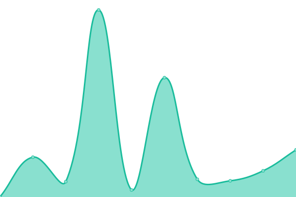

# [📈 Live Status](https://status.adrianub.dev): <!--live status--> **Todos los sistemas están operativos.**

This repository contains the open-source uptime monitor and status page for [Adrián UB](adrianub.dev), powered by [Upptime](https://github.com/upptime/upptime).

With [Upptime](https://upptime.js.org), you can get your own unlimited and free uptime monitor and status page, powered entirely by a GitHub repository. We use [Issues](https://github.com/adrian-ub/status.adrianub.dev/issues) as incident reports, [Actions](https://github.com/adrian-ub/status.adrianub.dev/actions) as uptime monitors, and [Pages](https://status.adrianub.dev) for the status page.

<!--start: status pages-->
<!-- This summary is generated by Upptime (https://github.com/upptime/upptime) -->
<!-- Do not edit this manually, your changes will be overwritten -->
<!-- prettier-ignore -->
| URL | Status | History | Response Time | Uptime |
| --- | ------ | ------- | ------------- | ------ |
|  [Adrián UB](https://adrianub.dev) | Arriba | [adrian-ub.yml](https://github.com/adrian-ub/status.adrianub.dev/commits/HEAD/history/adrian-ub.yml) | 

 159ms
     
 | 

<a href="https://status.adrianub.dev/history/adrian-ub">100.00%</a>
    

|  [SalvaYA!](https://salvaya.com) | Arriba | [salva-ya.yml](https://github.com/adrian-ub/status.adrianub.dev/commits/HEAD/history/salva-ya.yml) | 

 142ms
     
 | 

<a href="https://status.adrianub.dev/history/salva-ya">100.00%</a>
    

|  [Banners](https://banners.adrianub.vercel.app) | Arriba | [banners.yml](https://github.com/adrian-ub/status.adrianub.dev/commits/HEAD/history/banners.yml) | 

 524ms
     
 | 

<a href="https://status.adrianub.dev/history/banners">100.00%</a>
    

|  [Netlify CMS Oauth](https://netlify-cms.adrianub.vercel.app) | Arriba | [netlify-cms-oauth.yml](https://github.com/adrian-ub/status.adrianub.dev/commits/HEAD/history/netlify-cms-oauth.yml) | 

 407ms
     
 | 

<a href="https://status.adrianub.dev/history/netlify-cms-oauth">100.00%</a>
    

|  [TailwindCSS Brand Colors](https://tailwindcss-brand-colors.pages.dev) | Arriba | [tailwind-css-brand-colors.yml](https://github.com/adrian-ub/status.adrianub.dev/commits/HEAD/history/tailwind-css-brand-colors.yml) | 

 177ms
     
 | 

<a href="https://status.adrianub.dev/history/tailwind-css-brand-colors">100.00%</a>
    

<!--end: status pages-->

[**Visit our status website →**](https://status.adrianub.dev)

## 📄 License

- Powered by: [Upptime](https://github.com/upptime/upptime)
- Code: [MIT](./LICENSE) © [Adrián UB](adrianub.dev)
- Data in the `./history` directory: [Open Database License](https://opendatacommons.org/licenses/odbl/1-0/)
